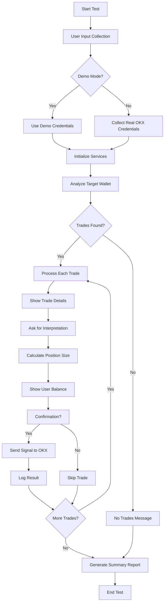
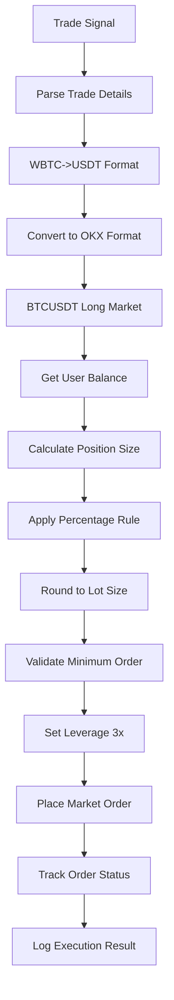

# Copy Trading Test Script - Design Document

## Overview

This document outlines the technical design and architecture for a comprehensive copy trading test script that simulates real-world copy trading scenarios on the Zenith Trader platform.

## System Architecture

### High-Level Architecture

```
┌─────────────────────────────────────────────────────────────────┐
│                    Copy Trading Test Script                      │
├─────────────────────────────────────────────────────────────────┤
│                                                                 │
│  ┌─────────────────┐  ┌─────────────────┐  ┌─────────────────┐ │
│  │   User Input    │  │  Test Runner    │  │  Result Logger  │ │
│  │   Module        │  │   Engine        │  │                 │ │
│  └─────────────────┘  └─────────────────┘  └─────────────────┘ │
│           │                     │                     │         │
│           └─────────────────────┼─────────────────────┘         │
│                                 │                               │
│  ┌─────────────────────────────────────────────────────────────┐ │
│  │                    Test Core Engine                          │ │
│  └─────────────────────────────────────────────────────────────┘ │
│                                 │                               │
│           ┌─────────────────────┼─────────────────────┐         │
│           │                     │                     │         │
│  ┌─────────────────┐  ┌─────────────────┐  ┌─────────────────┐ │
│  │ Analysis Service│  │ Copy Trading    │  │  OKX Client     │ │
│  │   (Zerion)      │  │    Service      │  │   Integration   │ │
│  └─────────────────┘  └─────────────────┘  └─────────────────┘ │
│                                                                 │
└─────────────────────────────────────────────────────────────────┘
```

### Core Components

#### 1. User Input Module
- **Purpose**: Collect user preferences and credentials
- **Responsibilities**:
  - Demo mode vs real trading selection
  - OKX credential collection and validation
  - Target wallet configuration
  - Copy trading preferences (leverage, position size)

#### 2. Test Runner Engine
- **Purpose**: Orchestrate the test flow
- **Responsibilities**:
  - Manage test execution lifecycle
  - Handle trade processing flow
  - Coordinate between services
  - Error handling and recovery

#### 3. Analysis Service Integration
- **Purpose**: Analyze target wallet trading history
- **Integration**: Uses existing `analysisService.js`
- **Responsibilities**:
  - Fetch wallet transaction history (3 months)
  - Process and normalize trade data
  - Generate trade signals from historical data

#### 4. Copy Trading Service Integration
- **Purpose**: Execute copy trades based on signals
- **Integration**: Uses existing `copyTradingService.js`
- **Responsibilities**:
  - Process trade signals
  - Calculate position sizes
  - Execute trades on OKX (demo or real)

#### 5. OKX Client Integration
- **Purpose**: Interface with OKX API
- **Integration**: Uses existing `okxService.js` or `okxClient.js`
- **Responsibilities**:
  - Account balance management
  - Order placement
  - Position monitoring

#### 6. Result Logger
- **Purpose**: Track and report test results
- **Responsibilities**:
  - Detailed logging of all operations
  - Success/failure tracking
  - Performance metrics collection
  - User-friendly output formatting

## Data Flow

### Main Test Flow



### Trade Processing Flow



## Service Integration Points

### Analysis Service Integration
- **File**: `src/services/analysisService.js`
- **Method**: `analyzeWallet(address)`
- **Usage**: Analyze target wallet's 3-month trading history
- **Data Flow**: 
  ```
  Target Wallet Address → analysisService → Position Ledger Data → Trade History
  ```

### Copy Trading Service Integration
- **File**: `src/services/copyTradingService.js`
- **Methods**: 
  - `initialize(okxConfig)`
  - `processPositionSignal(signal, balance)`
  - `getOKXBalance()`
- **Usage**: Execute copy trades based on analyzed signals
- **Data Flow**:
  ```
  Trade Signal → Copy Trading Service → OKX API → Trade Execution
  ```

### Position Signal Service Integration
- **File**: `src/services/positionSignalService.js`
- **Method**: `getNewPositionSignals(address, sinceDate)`
- **Usage**: Detect new trading signals (optional enhancement)
- **Data Flow**:
  ```
  Wallet Address → Position Signal Service → Signal Detection → Copy Trading
  ```

### OKX Client Integration
- **File**: `src/services/okxService.js` or `src/services/okxClient.js`
- **Methods**:
  - `getBalance()`
  - `submitOrder()`
  - `setLeverage()`
  - `getTicker()`
- **Usage**: Interface with OKX trading API
- **Data Flow**:
  ```
  Trading Commands → OKX Client → OKX API → Execution Results
  ```

## Configuration Management

### Environment Variables
```javascript
// Required
OKX_API_KEY=your_api_key
OKX_API_SECRET=your_api_secret  
OKX_API_PASSPHRASE=your_passphrase
OKX_DEMO_MODE=1  // 1 for demo, 0 for real trading

// Optional
TARGET_WALLET=0xc82b2e484b161d20eae386877d57c4e5807b5581
DEFAULT_LEVERAGE=3
DEFAULT_PERCENTAGE=5
MIN_TRADE_SIZE=10
LOG_LEVEL=info
```

### Runtime Configuration
```javascript
const config = {
  targetWallet: '0xc82b2e484b161d20eae386877d57c4e5807b5581',
  timeframe: '3months', // Analysis timeframe
  defaultLeverage: 3,   // Default leverage for long positions
  defaultPercentage: 5,  // Default position size percentage
  minTradeSize: 10,      // Minimum trade size in USDT
  demoMode: true,        // Demo mode flag
  okx: {
    apiKey: '',
    secretKey: '',
    passphrase: '',
    isDemo: true
  }
};
```

## Error Handling Strategy

### Error Categories
1. **Input Validation Errors**: Invalid user input or credentials
2. **API Errors**: OKX API failures or rate limits
3. **Analysis Errors**: Wallet analysis failures
4. **Execution Errors**: Trade execution failures
5. **Network Errors**: Connectivity issues

### Error Handling Patterns
```javascript
// Try-catch wrapper for async operations
async function safeExecute(operation, fallbackValue = null) {
  try {
    return await operation();
  } catch (error) {
    console.error(`Operation failed: ${error.message}`);
    return fallbackValue;
  }
}

// Retry mechanism for API calls
async function retryOperation(operation, maxRetries = 3, delay = 1000) {
  for (let i = 0; i < maxRetries; i++) {
    try {
      return await operation();
    } catch (error) {
      if (i === maxRetries - 1) throw error;
      await new Promise(resolve => setTimeout(resolve, delay));
    }
  }
}
```

## Logging Strategy

### Log Levels
- **DEBUG**: Detailed technical information
- **INFO**: General operation information
- **WARN**: Warning conditions
- **ERROR**: Error conditions

### Log Structure
```javascript
{
  timestamp: '2024-01-01T12:00:00Z',
  level: 'INFO',
  component: 'CopyTradingTest',
  operation: 'TradeExecution',
  tradeId: 'trade_123',
  wallet: '0x123...abc',
  token: 'BTC',
  amount: 0.1,
  price: 45000,
  status: 'SUCCESS',
  duration: 1200,
  metadata: {}
}
```

## Performance Considerations

### Rate Limiting
- OKX API: 20 requests/second, 600 requests/minute
- Zerion API: Implement exponential backoff
- Implement request queuing and throttling

### Memory Management
- Clear large objects between operations
- Use streaming for large datasets
- Implement garbage collection hints

### Timeout Management
- API calls: 30 seconds timeout
- User input: 5 minutes timeout
- Overall test: 1 hour timeout

## Security Considerations

### Credential Management
- Never log sensitive information
- Use environment variables for credentials
- Implement secure credential storage
- Clear credentials from memory after use

### Input Validation
- Validate all user inputs
- Sanitize wallet addresses
- Validate numerical ranges
- Check for malicious inputs

### API Security
- Use HTTPS for all API calls
- Implement proper authentication
- Validate API responses
- Handle API errors gracefully

## Testing Strategy

### Unit Tests
- Test individual components in isolation
- Mock external dependencies
- Test error conditions
- Measure code coverage

### Integration Tests
- Test service interactions
- Test with real APIs (demo mode)
- Test error propagation
- Test performance characteristics

### End-to-End Tests
- Test complete user flows
- Test with real data
- Test user experience
- Test system reliability

## Deployment Strategy

### Local Development
- Run test script directly with Node.js
- Use local configuration files
- Enable debug logging
- Test with demo credentials

### Production Deployment
- Package as standalone executable
- Use environment variables
- Implement proper logging
- Add monitoring and alerting

## Monitoring and Observability

### Metrics to Track
- Test execution time
- Success/failure rates
- API response times
- Error rates by category
- Memory usage patterns

### Alerting
- High failure rates
- API rate limit exceeded
- Credential validation failures
- System resource exhaustion

## Future Enhancements

### Phase 2 Enhancements
- Multiple wallet support
- Advanced risk management
- Real-time monitoring dashboard
- Automated reporting
- Performance optimization

### Phase 3 Enhancements
- Machine learning integration
- Advanced signal processing
- Multi-exchange support
- Portfolio optimization
- Risk analytics

## Conclusion

This design provides a comprehensive architecture for building a robust copy trading test script that integrates seamlessly with the existing Zenith Trader platform. The modular design ensures maintainability, testability, and scalability while providing a realistic simulation of copy trading scenarios.